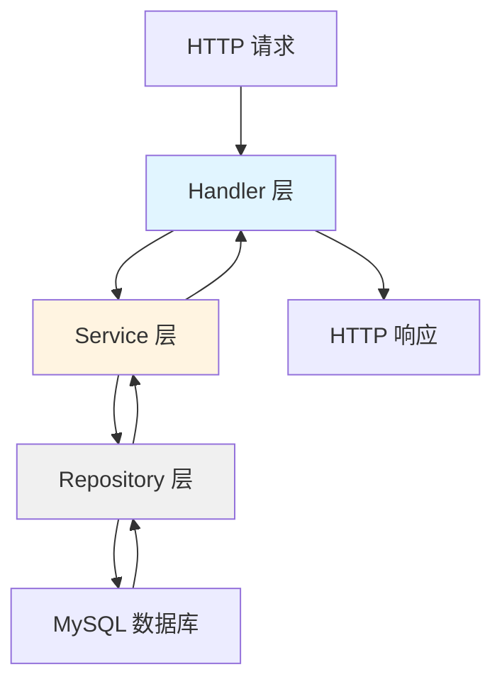
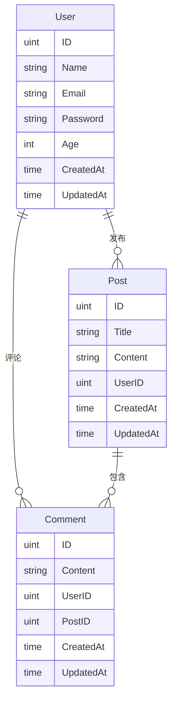

# Task4 - Go Web 博客系统

一个基于 Go 语言和 Gin 框架开发的 RESTful API 博客系统,实现了用户注册登录、文章管理和评论功能。

## 📋 项目概述

Task4 是一个完整的博客后端系统,采用经典的三层架构设计(Handler-Service-Repository),提供了用户认证、文章发布、评论互动等核心功能。项目使用 JWT 进行身份验证,bcrypt 加密存储密码,GORM 作为 ORM 框架操作 MySQL 数据库。

## ✨ 功能特性

### 用户管理
- ✅ 用户注册(邮箱验证)
- ✅ 用户登录(JWT Token 认证)
- ✅ 密码加密存储(bcrypt)

### 文章管理
- ✅ 创建文章
- ✅ 查询文章列表
- ✅ 查询单篇文章详情
- ✅ 更新文章(仅作者)
- ✅ 删除文章(仅作者)

### 评论系统
- ✅ 发表评论
- ✅ 查询文章的所有评论

### 安全特性
- ✅ JWT Token 认证中间件
- ✅ Token 过期时间验证
- ✅ 用户权限验证(文章作者校验)

## 🛠️ 技术栈

| 技术 | 版本 | 用途 |
|------|------|------|
| **Go** | 1.x | 编程语言 |
| **Gin** | latest | Web 框架 |
| **GORM** | latest | ORM 框架 |
| **MySQL** | 5.7+ | 数据库 |
| **JWT** | golang-jwt/jwt/v5 | 身份认证 |
| **bcrypt** | golang.org/x/crypto | 密码加密 |
| **zap** | go.uber.org/zap | 高性能日志库 |
| **lumberjack** | gopkg.in/natefinch/lumberjack.v2 | 日志切割 |

## 📁 项目结构

```
task4/
├── main.go                 # 程序入口
├── handler/                # 控制器层(处理 HTTP 请求)
│   ├── user.go            # 用户相关接口
│   ├── post.go            # 文章相关接口
│   └── comment.go         # 评论相关接口
├── service/                # 业务逻辑层
│   ├── user.go            # 用户业务逻辑
│   ├── post.go            # 文章业务逻辑
│   └── comment.go         # 评论业务逻辑
├── repository/             # 数据访问层
│   └── database.go        # 数据库连接和初始化
├── model/                  # 数据模型
│   └── model.go           # User, Post, Comment 模型定义
├── router/                 # 路由配置
│   └── router.go          # 路由注册和分组
├── middleware/             # 中间件
│   ├── jwt_auth.go        # JWT 认证中间件
│   └── logger_middleware.go # 日志中间件
├── utils/                  # 工具函数
│   ├── jwt.go             # JWT 生成和解析
│   ├── password.go        # 密码加密和验证
│   ├── response.go        # 统一响应格式
│   └── logger.go          # 日志工具
├── logs/                   # 日志文件目录
│   ├── info.log           # Info 级别日志
│   ├── error.log          # Error 级别日志
│   └── debug.log          # Debug 级别日志
├── test/                   # 测试文件
│   └── register_test.go   # 注册接口测试
└── docs/                   # API 文档
    ├── api.md             # API 文档(Markdown)
    └── api.json           # API 文档(JSON)
```

## 🏗️ 架构设计

### 三层架构



- **Handler 层**: 处理 HTTP 请求,参数验证,调用 Service 层
- **Service 层**: 业务逻辑处理,权限验证,数据组装
- **Repository 层**: 数据库操作,数据持久化

### 数据模型关系



## 🚀 快速开始

### 前置要求

- Go 1.16 或更高版本
- MySQL 5.7 或更高版本
- Git

### 安装步骤

1. **克隆项目**
```bash
git clone https://github.com/wangxg-sj/web3-learning.git
cd web3-learning/gobasic/task4
```

2. **安装依赖**
```bash
go mod download
```

3. **配置数据库**

创建 MySQL 数据库:
```sql
CREATE DATABASE task4 CHARACTER SET utf8mb4 COLLATE utf8mb4_unicode_ci;
```

修改数据库连接配置(在 `repository/database.go` 中):
```go
// 修改为你的数据库配置
db, err := gorm.Open(mysql.Open("root:your_password@tcp(127.0.0.1:3306)/task4?charset=utf8mb4&parseTime=True&loc=Local"))
```

4. **运行项目**
```bash
go run main.go
```

服务将在 `http://localhost:8080` 启动

### 数据库迁移

项目启动时会自动执行数据库迁移,创建以下表:
- `users` - 用户表
- `posts` - 文章表
- `comments` - 评论表

## 📖 API 文档

### 基础信息

- **Base URL**: `http://localhost:8080/api/v1`
- **认证方式**: JWT Token (Header: `Authorization`)

### 公开接口(无需认证)

#### 1. 用户注册

**接口**: `POST /api/v1/register`

**请求体**:
```json
{
  "name": "张三",
  "email": "zhangsan@example.com",
  "password": "password123"
}
```

**响应示例**:
```json
{
  "code": 201,
  "msg": "注册成功",
  "data": null
}
```

#### 2. 用户登录

**接口**: `POST /api/v1/login`

**请求体**:
```json
{
  "email": "zhangsan@example.com",
  "password": "password123"
}
```

**响应示例**:
```json
{
  "code": 200,
  "msg": "登录成功",
  "data": {
    "token": "eyJhbGciOiJIUzI1NiIsInR5cCI6IkpXVCJ9..."
  }
}
```

### 需要认证的接口

> ⚠️ 以下接口需要在请求头中携带 `Authorization: <token>`

#### 3. 创建文章

**接口**: `POST /api/v1/posts`

**请求头**:
```
Authorization: eyJhbGciOiJIUzI1NiIsInR5cCI6IkpXVCJ9...
```

**请求体**:
```json
{
  "title": "我的第一篇文章",
  "content": "这是文章内容..."
}
```

**响应示例**:
```json
{
  "code": 200,
  "msg": "创建成功",
  "data": null
}
```

#### 4. 获取文章列表

**接口**: `GET /api/v1/posts`

**响应示例**:
```json
{
  "code": 200,
  "msg": "获取成功",
  "data": [
    {
      "ID": 1,
      "Title": "我的第一篇文章",
      "Content": "这是文章内容...",
      "UserID": 1,
      "Comments": [],
      "CreatedAt": "2024-12-07T10:00:00Z",
      "UpdatedAt": "2024-12-07T10:00:00Z"
    }
  ]
}
```

#### 5. 获取单篇文章

**接口**: `GET /api/v1/posts/:id`

**响应示例**:
```json
{
  "code": 200,
  "msg": "获取成功",
  "data": {
    "ID": 1,
    "Title": "我的第一篇文章",
    "Content": "这是文章内容...",
    "UserID": 1,
    "Comments": [
      {
        "ID": 1,
        "Content": "很棒的文章!",
        "UserID": 2,
        "PostID": 1
      }
    ],
    "CreatedAt": "2024-12-07T10:00:00Z",
    "UpdatedAt": "2024-12-07T10:00:00Z"
  }
}
```

#### 6. 更新文章

**接口**: `PUT /api/v1/posts/:id`

**权限**: 仅文章作者可更新

**请求体**:
```json
{
  "title": "修改后的标题",
  "content": "修改后的内容"
}
```

#### 7. 删除文章

**接口**: `DELETE /api/v1/posts/:id`

**权限**: 仅文章作者可删除

**响应示例**:
```json
{
  "code": 200,
  "msg": "删除成功",
  "data": null
}
```

#### 8. 发表评论

**接口**: `POST /api/v1/comments`

**请求体**:
```json
{
  "content": "很棒的文章!",
  "post_id": 1
}
```

#### 9. 获取文章评论

**接口**: `GET /api/v1/comments/:post_id`

**响应示例**:
```json
{
  "code": 200,
  "msg": "获取成功",
  "data": [
    {
      "ID": 1,
      "Content": "很棒的文章!",
      "UserID": 2,
      "PostID": 1,
      "User": {
        "ID": 2,
        "Name": "李四",
        "Email": "lisi@example.com"
      }
    }
  ]
}
```

## 🧪 测试

### 运行测试

项目包含单元测试和集成测试:

```bash
# 运行所有测试
go test ./...

# 运行特定测试文件
go test ./test/register_test.go

# 运行测试并显示详细信息
go test -v ./...
```

### 使用 Postman/curl 测试

**示例: 注册并登录**

```bash
# 1. 注册用户
curl -X POST http://localhost:8080/api/v1/register \
  -H "Content-Type: application/json" \
  -d '{
    "name": "测试用户",
    "email": "test@example.com",
    "password": "123456"
  }'

# 2. 登录获取 Token
curl -X POST http://localhost:8080/api/v1/login \
  -H "Content-Type: application/json" \
  -d '{
    "email": "test@example.com",
    "password": "123456"
  }'

# 3. 使用 Token 创建文章
curl -X POST http://localhost:8080/api/v1/posts \
  -H "Content-Type: application/json" \
  -H "Authorization: <your_token_here>" \
  -d '{
    "title": "测试文章",
    "content": "这是测试内容"
  }'
```

## 🔧 配置说明

### JWT 配置

JWT 密钥配置在 `utils/jwt.go`:
```go
jwtSecretKey := "1qaz@WSX"  // 生产环境请使用环境变量
```

Token 有效期: 24 小时

### 数据库配置

数据库连接配置在 `repository/database.go`:
```go
dsn := "root:1qaz@WSX@tcp(127.0.0.1:3306)/task4?charset=utf8mb4&parseTime=True&loc=Local"
```

**建议**: 生产环境使用环境变量管理敏感配置

### 日志配置

项目使用 **zap** 高性能日志库,支持日志级别分离和自动切割。

#### 环境配置

通过 `APP_ENV` 环境变量控制日志行为:

```bash
# 开发环境(默认)
APP_ENV=development go run main.go
# - 输出 Debug/Info/Error 日志
# - 控制台彩色输出
# - 日志文件: info.log, error.log, debug.log

# 生产环境
APP_ENV=production go run main.go
# - 仅输出 Info/Error 日志
# - 仅文件输出
# - 日志文件: info.log, error.log
```

#### 日志级别

| 级别 | 用途 | 文件 |
|------|------|------|
| **Debug** | 调试信息 | `logs/debug.log` |
| **Info** | 正常操作日志 | `logs/info.log` |
| **Warn** | 警告信息 | `logs/error.log` |
| **Error** | 错误信息 | `logs/error.log` |

#### 日志格式

所有日志采用 **JSON 结构化格式**:

```json
{
  "level": "info",
  "ts": "2024-12-08T02:20:01.839+0800",
  "caller": "handler/user.go:43",
  "msg": "用户注册成功",
  "email": "test@example.com",
  "name": "测试用户"
}
```

**字段说明**:
- `level`: 日志级别(debug/info/warn/error)
- `ts`: 时间戳(ISO8601 格式)
- `caller`: **真实的调用位置**(文件名:行号)
- `msg`: 日志消息
- 其他字段: 自定义的结构化字段

#### 日志切割

使用 **lumberjack** 自动切割日志:
- 单文件最大: 100MB
- 保留天数: 30 天
- 最多备份: 10 个文件
- 自动压缩旧日志

#### 使用示例

```go
import (
    "github.com/wangxg-sj/web3-learning/gobasic/task4/utils"
    "go.uber.org/zap"
)

// Info 日志
utils.Info("用户登录成功", zap.String("email", email))

// Error 日志
utils.Error("数据库连接失败", zap.Error(err))

// Debug 日志
utils.Debug("处理请求", zap.String("path", "/api/v1/posts"))

// 带多个字段
utils.Info("创建文章", 
    zap.Uint("user_id", userID),
    zap.String("title", title),
    zap.Int("length", len(content)),
)
```

#### HTTP 请求日志

所有 HTTP 请求自动记录:
- 请求方法和路径
- 响应状态码
- 请求耗时
- 客户端 IP

示例日志:
```json
{
  "level": "info",
  "ts": "2024-12-08T01:56:54.123+0800",
  "msg": "HTTP 请求",
  "status": 200,
  "method": "POST",
  "path": "/api/v1/register",
  "ip": "127.0.0.1",
  "duration": 0.045
}
```

## 📝 开发指南

### 添加新功能

1. 在 `model/` 中定义数据模型
2. 在 `service/` 中实现业务逻辑
3. 在 `handler/` 中创建 HTTP 处理器
4. 在 `router/router.go` 中注册路由

### 代码规范

- 遵循 Go 官方代码规范
- 使用 `gofmt` 格式化代码
- 添加必要的注释和文档

## 🐛 常见问题

### 1. 数据库连接失败

**问题**: `连接数据库失败: Error 1045: Access denied`

**解决**: 检查 `repository/database.go` 中的数据库用户名和密码是否正确

### 2. Token 验证失败

**问题**: `无效的token` 或 `token已过期`

**解决**: 
- 确保请求头中包含 `Authorization` 字段
- 检查 Token 是否过期(有效期 24 小时)
- 重新登录获取新 Token

### 3. 权限不足

**问题**: `没有权限删除该帖子` 或 `没有权限更新该帖子`

**解决**: 只有文章作者才能修改或删除自己的文章,请使用正确的用户 Token

## 📄 许可证

本项目仅用于学习目的。

## 👥 贡献

欢迎提交 Issue 和 Pull Request!

## 📧 联系方式

- GitHub: [@wangxg-sj](https://github.com/wangxg-sj)
- 项目地址: [web3-learning](https://github.com/wangxg-sj/web3-learning)

---

**最后更新**: 2024-12-08
