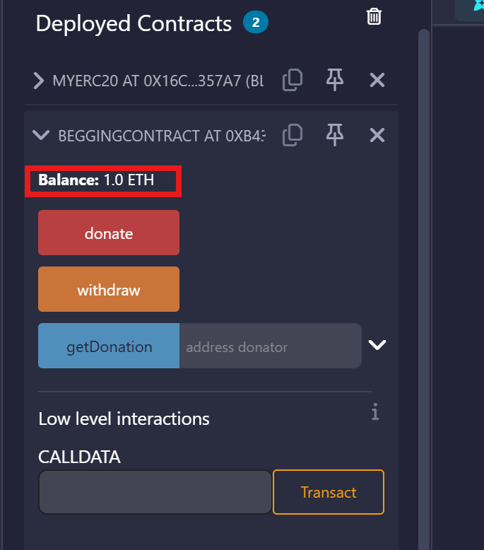
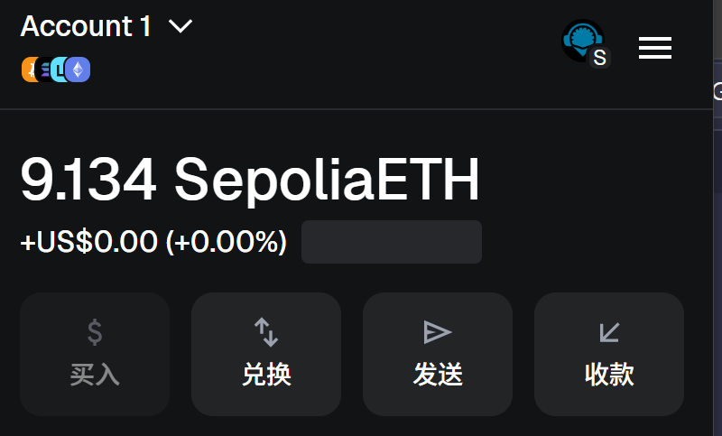
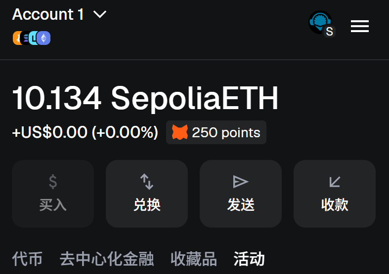
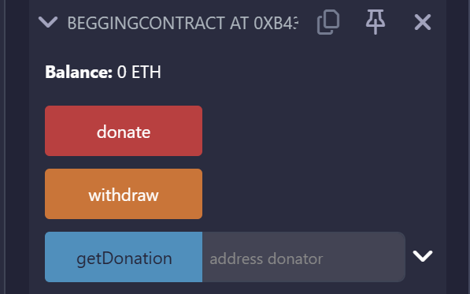
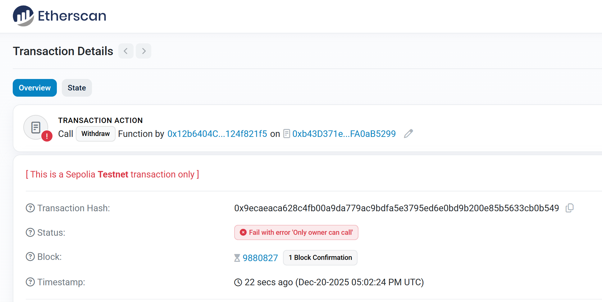
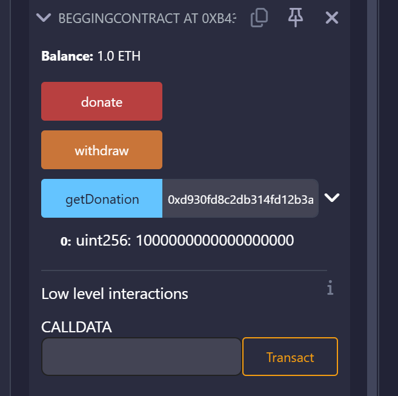

# BeggingContract (限时捐赠合约)

这是一个基于 Solidity 编写的简单捐赠合约，允许用户在指定的时间范围内进行捐赠，且只有合约所有者可以提取资金。

## 核心功能

1. **限时捐赠**：合约在构造时设置了逻辑开始时间和结束时间，用户只能在此期间通过支付 ETH 进行“施舍”。
2. **所有者提现**：只有部署合约的地址（Owner）可以将合约中的所有余额提取出来。
3. **捐赠记录查询**：支持实时查看任意地址的累计捐赠金额。

## 合约方法说明

### 1. 构造函数 `constructor`

- **功能**：初始化合约所有者，并设置捐赠的有效期。
- **参数**：
  - `uint256 startTime`: 捐赠开始的时间戳。
  - `uint256 endTime`: 捐赠结束的时间戳。
- **测试**：部署是传入时间戳 2025/12/21 00:00:00 和 2025/12/21 02:00:00，
  合约地址：0xb43D371e2EA2cEE59216cF46610e8f7FA0aB5299

### 2. 捐赠 `donate`

- **功能**：用户调用此函数并发送 ETH 来进行捐赠。
- **限制**：
  - 必须在设定的有效期内。
  - 发送的金额必须大于 0。
- **事件提示**：操作成功后会触发 `Donation` 事件。
- **测试**：向合约转账 1 ETH 下图为合约余额
  

### 3. 提现 `withdraw`

- **功能**：将合约内的余额全部转移给合约所有者。
- **限制**：仅限 `Owner` 调用。
- **安全实现**：代码中预留了多种转账方式（`transfer`, `send`, `call`）的示例注释。
- **测试 owner 账户:** 调用取款前账户余额
  
  调用 withdraw 取款后账户余额
  
  调用 withdraw 取款后合约余额
  
- **测试其他账户取款:** 调用取款报错
  

### 4. 查询捐赠额 `getDonation`

- **功能**：查看指定地址的捐赠总额。
- **参数**：`address donator`
- **测试**：调用 `getDonation(msg.sender)`，下图为查询结果
  

## 快速使用

- **部署合约**：需要传入两个 Unix 时间戳。
- **进行捐赠**：调用 `donate` 方法，并附带你想要捐赠的 Ether。
- **检查状态**：使用 `getDonation(你的地址)` 确认是否记录成功。
